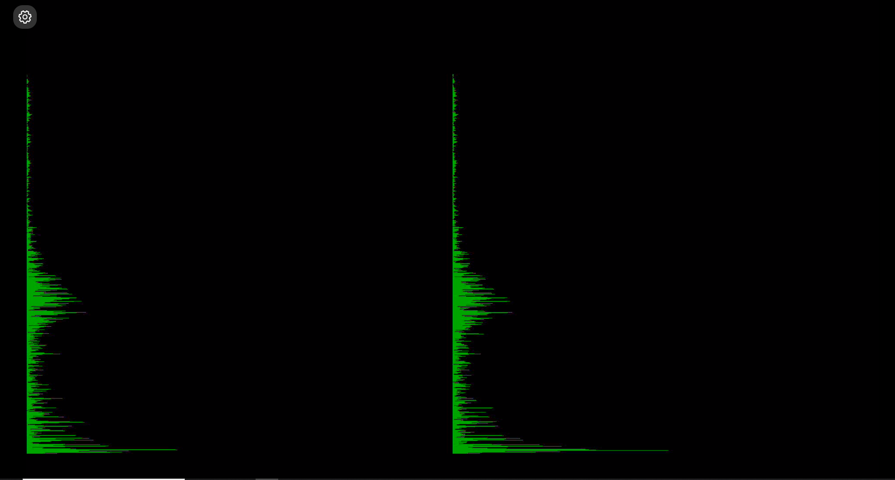

# FPGA_projects
* Audio project
* FFT Video
* FFT Video 2048

## Audio project
Simple variation of the base block design of PYNQ Z2 board.
It will simply stream the audio through Vivado IPs I2S Rx-Tx (AXI stream @ 100 MHz); PYNQ audio codec will take care of the analog-to-digital and digital-to-analog conversions.

## FFT VIDEO
AXI audio stream demuxed in L-channel and R-channel, 1024-point FFT (Vivado IP) is applied to both channels and finally the output magnitude is displayed on an HDMI monitor (1920x1080 @ 30Hz).

## FFT VIDEO 2048
Same as the previous version with some tweaks. Only a real input is fed into the FFT and, as suggested in the vivado FFT logic core documentation, only the second half of the output is considered.  
A windowing is added to lowering spectral leakage, by default no window is applied; to enable windowing it is necessary to set the selector to '1', it will multiply the input by a factor sored in a dual port RAM accessible from the notebook.  
In the BRAM is initially stored an Hann-function, but is also selectable Hamming, Cosine, Gaussian and Rectangular window or it is possible to define a custom function (via Python notebook).  

It is possible to dispaly the $$log_2$$ of the output. The logarithm is computed in the following way:  

- Find the MSB via a priority encoder ($$PE_{out}$$)
- Compute the taylor expasion of $$log_2(x\times 2^{-PE_{out}})$$ (III order implementation)
- Result: $$log_2(x)=PE+\frac{1}{ln(2)}(x\times 2^{-PE_{out}}-\frac{(x\times 2^{-PE_{out}})^2}{2}+\frac{(x\times 2^{-PE_{out}})^3}{3})$$ 

FFT parameters:
- 2048 N-point
- Scaled (fixed point)
- 24 bit input/output width
- Pipelined/Streaming architecture
- Non real time
- Index is embedded in the TUSER axis output

## Future implementation
- Video frame overlay to show the frequency axis (in the display)
- Sync FFT output ($$\sim23$$Hz) with the monitor refresh rate (30Hz)
- Find a better way to display the spectrum (now is linear in the frequencies)

## Logarithmic output
This is an example of the logarithm result.

    

The red signa is the input and subsequently we have the Priority encoder output (yellow), I order approximation (orange), II order approximation (light blue), III order approximation (purple).

## FFT output example
Actual FFT output with a song in input.

    

